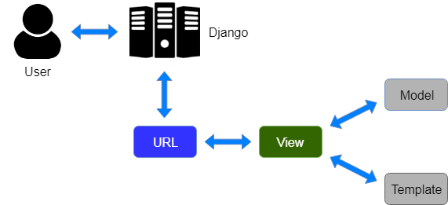

# Overview <a name="overview"></a>

This app is my way of learning and exploring webapps and RESTful APIs in Django. The idea is that you create "content" that can be cross-posted to other subreddits at specified times. 

## Table of Contents

1. [My Notes](#mynotes)
1. [Current](#current)
    1. [Quick Notes](#quicknotes)
1. [Post Scheduler for Reddit](#post_scheduler)
    1. [Tools](#tools)
        1. [Django](#django)
        1. [Resources](#resources)
    1. [Goals](#goals)
    1. [TODO](#todo)
    1. [Steps to Submit a Post](#submit_a_post)
        * [Hierarchy](#hierarchy)
    1. [Manage Content Page](#manage_content_page)
    1. [Steps to Submit a Post on Existing Apps](#existing_submit_post)
    1. [Navigation Urls](#urls)
    1. [Testing](#testing)
1. [Database](#database)
    1. [Currently on Database](#currently_on_database)
    1. [Add to `scheduler`](#add_to_scheduler)
    1. [Add to `polls`](#add_to_polls)
1. [Scratch](#scratch)

# My Notes <a name="mynotes"></a>

# Current <a name="current"></a>

https://docs.djangoproject.com/en/3.2/intro/tutorial05/#when-testing-more-is-better

## Quick Notes <a name="quicknotes"></a>
 <a name=""></a>

For the tutorial:

`"scheduler/" == "polls/"`

***

# Post Scheduler for Reddit <a name="post_scheduler"></a>

## Tools <a name="tools"></a>



- Frontend: Vue, need node (use nvm)
- Backend: Django

### Django <a name="django"></a>

Excellent writeup structure of django  
https://djangobook.com/mdj2-django-structure/

Where do we put a particular function or class?

Does the function/class return a response?
  - Yes—it's a view. Put it in the views module (views.py).
  - No—it's not a view, it's app logic. Put it somewhere else (somewhere_else.py).

When you have code that isn’t a view, you create a new Python module (.py file) inside your app and put related functions and classes inside the file.

### Resources <a name="resources"></a>

Authentication  
https://docs.djangoproject.com/en/3.2/topics/auth/default/

## Goals: <a name="goals"></a>

- [ ] Submit info to Django and validate database
- [ ] Make api call to reddit

## TODO: <a name="todo"></a>

- [x] Change model. Move `user` from `Content` to `Post`.
- [ ] Create login/registration page.
- [ ] When building Post Creation page, make sure Post.override_title inherits Content.default_title if blank.
- [ ] Create Content page
    - [x] Edit
    - [ ] Delete
- [ ] Create Post page

## Steps to submit a post <a name="submit_a_post"></a>

Add content:

- Title
- Post kind:
    - link
    - self (text)
    - image
        - upload file to imgur
    - video
    - videogif

API Requests to reddit made in the View

### Hierarchy <a name="hierarchy"></a>

1. User has Content
2. Content is submitted through Posts

Visually, if using database input, looks like this:

```
u 'beggarscantbeusers' id=3
| 
| c 'test 1' id=1s
| | p 'post 1' id=1
| 
| c 'test 2' id=2
| | p 'post 2' id=2
| | p 'post 3' id=3
| 
| c 'test 3' id=3
```

## Manage Content Page: <a name="manage_content_page"></a>

- Posts are made with your chosen default title. Once you create a post, you can then select that post and schedule posts to different subs individually.

## Steps to submit post on existing apps: <a name="existing_submit_post"></a>

1. **First Screen**
    - When adding content, if you typed a title it won't change when you select a different type of post
    - Uploads images/video to imgur
    - After you have your content on there and select "Save and Continue", you are redirected to permissions screen for app permission (on reddit) if you are signed in. If you're signed out, it takes you to login page to get to permissions.

2. **Next screen**
    - "Post as" feature
    - Subreddit
    - Strategy:
        - Post Now "The post will go live immediately"
        - Next 24 hours "Later will automatically compute the best posting time for the given subreddit, based on your selection"
        - Next 7 days
        - Custom Time
    - Override Title "Leave blank to use the default title for this post"
    - Advanced (dropdown):
        - Link Flair (drop down that pulls flairs from sub)
        - Send Replies to Inbox checkbox

## Navigation Urls <a name="urls"></a>

<!-- <details> -->
<!-- <summary>Navigation</summary> -->
Navigation

```
# homepage shows contents with cross posts and existing schedules
/scheduler/

# new content
/scheduler/new/

# schedule post(s)
/scheduler/<content_id>/post/cross/

# edit content (may affect scheduled posts)
/scheduler/<content_id>/edit/

# content page with list of scheduled and upcoming posts
/scheduler/<content_id>/

# edit upcoming post
/scheduler/<content_id>/<post_id>/edit/
```

```
# List of content
dashboard.app.com/content/

# Create x-post
dashboard.app.com/content/407379/posts/create/

# Edit Content
dashboard.app.com/content/407379/posts/create/
```

<!-- </details> -->


## Testing: <a name="testing"></a>

*[When testing, more is better](https://docs.djangoproject.com/en/3.2/intro/tutorial05/#when-testing-more-is-better)*

As long as your tests are sensibly arranged, they won’t become unmanageable. Good rules-of-thumb include having:
- a separate TestClass for each model or view
- a separate test method for each set of conditions you want to test
- test method names that describe their function


# Database <a name="database"></a>

## Currently on database file <a name="currently_on_database"></a>

How to make edits to model.  
https://pytutorial.com/how-to-solve-you-are-trying-to-add-a-non-nullable-field-to-without-a-default

Steps I took to edit model:

- delete offending fields: creation_date
  - makemigrations
  - migrate
- add new fields to content
  - makemigrations
    ```
    You are trying to add the field 'created_at' with 'auto_now_add=True' to content without a default; the database needs something to populate existing rows.
    
     1) Provide a one-off default now (will be set on all existing rows)
     2) Quit, and let me add a default in models.py
    Select an option: 1
    Please enter the default value now, as valid Python
    You can accept the default 'timezone.now' by pressing 'Enter' or you can provide another value.
    The datetime and django.utils.timezone modules are available, so you can do e.g. timezone.now
    Type 'exit' to exit this prompt
    [default: timezone.now] >>> 
    ```
  - migrate
- remove Strategy, add remaining fields to Post. changed optional datetime fields to nullable/blankable 
  - makemigrations
  - migrate

Can delete through `shell`: `User.objects.all().delete()`

When changing systems, make sure to `python3 manage.py migrate` after pulling your changes.

## Add to `scheduler` <a name="add_to_scheduler"></a>

```
from scheduler.models import User, Content, Post
from django.utils import timezone
from datetime import timedelta

u = User(username="beggarscantbeusers")
u.save()

User.objects.all()
  <QuerySet [<User: beggarscantbeusers, id:2>]>

u = User.objects.get(pk=2)
c = Content(default_title='test 1', kind='link', created_at=timezone.now())
c.save()
p = Post(content=c, override_title="post 1", user=u, subreddit="sub1", strat="now", send_replies=False, flair="flair1", reddit_link="this.is/link1")
p.save()
c = Content(default_title='test 2', kind='text', created_at=timezone.now())
c.save()
p = Post(content=c, override_title="post 2", user=u, subreddit="sub2", strat="now", send_replies=True, flair="", reddit_link="this.is/link2")
p.save()
p = Post(content=c, override_title="post 3", user=u, subreddit="sub3", strat="custom", send_replies=True, flair="", reddit_link="this.is/link3")
p.save()
c = Content(default_title='test 3', kind='media', created_at=timezone.now())
c.save()

Post.objects.all()
  <QuerySet [<Post: post 1, id:1>, <Post: post 2, id:2>, <Post: post 3, id:3>]>
Strategy.objects.all()
  <QuerySet []>

s = Strategy(post=Post.objects.get(pk=3), strat_type="custom", strat_date=timezone.now()+timedelta(hours=24))
s.save()

# Get by filter
Content.objects.filter(created_at__year=current_year)

# Select certain User
u = User.objects.get(pk=1)
```

## Add to `polls` <a name="add_to_polls"></a>

```
from polls.models import Choice, Question
Question.objects.all()
from django.utils import timezone
q = Question(question_text="What's up?", pub_date=timezone.now())
q.save()
Question.objects.all()
q.choice_set.create(choice_text='Not much', votes=0)
q.choice_set.create(choice_text='The sky', votes=0)

Vote for "Not much" 3 times
```

# Scratch <a name="scratch"></a>

Printing context from within ContentDetailView.

```
{
    'object': <Content: test 1>, 
    'content': <Content: test 1>, 
    'view': <scheduler.views.ContentDetailView object at 0x7fa4e7742ac0>,
    'post_list':
        <QuerySet [
            <Post: post 1>, 
            <Post: post 2>, 
            <Post: post 3>
        ]>
}
```

Urlconf order notes:

Urlconf is giving me issues with how it wants to display the url in regards to order of content/post. Below are the combinations I've tried.

```
content.id post.id
with path
'content/<int:pk>/<int:post>/'
gives wrong
expected url when clicking on post 3: 'content/2/3'
actual: 'content/3/2', both 'content/3/2' and 'content/2/2' are same post id

post.id content.id
with path
'content/<int:pk>/<int:post>/'
gives right

post=post.id pk=content.id
with path
'content/<int:pk>/<int:post>/'
gives wrong
same as top but now urls look fine 'content/2/2' 'content/2/3'

post=content.id pk=post.id
with path
'content/<int:pk>/<int:post>/'
gives wrong url 'content/3/2' but right post content

post=content.id pk=post.id
with path
'content/<int:post>/<int:pk>/'
gives right

content.id post.id
with path
'content/<int:post>/<int:pk>/'
gives right
```

Process data in the View to save to Model

Where do I enter a post's schedule? Who keeps track of it? Where is the asynch task initiated and where does it finally post to reddit when the time comes?

Celery  
https://docs.celeryproject.org/en/stable/index.html

rq  
https://github.com/rq/rq

django q  
https://github.com/Koed00/django-q  
https://mattsegal.dev/simple-scheduled-tasks.html

discussion django scheduling  
https://www.reddit.com/r/django/comments/rz9tmr/scheduling_tasks/
https://www.reddit.com/r/Python/comments/97b7uw/does_anyone_have_experience_moving_from_celery_to/  

examples how to use reddit api with django  
https://github.com/MattSegal/reddit-feed
https://github.com/gruiz90/reddit-rest-api

```
# Links in django
<a class="nav-link" href="">Stuff</a>
```

```
Placeholder for a login page
{# <form action="">
    <button type="button" class="btn btn-primary">Log in</button>
</form> #}
```
