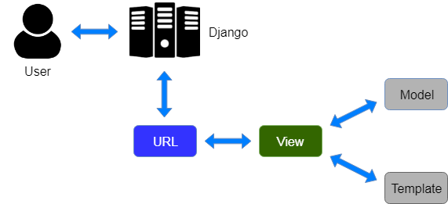

# My Notes

<details>
<summary>Quick Notes</summary>

## Current

https://docs.djangoproject.com/en/3.2/intro/tutorial05/#when-testing-more-is-better

## Quick Notes

For the tutorial:

`"scheduler/" == "polls/"`

***

</details>

# Post Scheduler for Reddit


## Tools



<details>
<summary>Tools</summary>

- Frontend: Vue, need node (use nvm)
- Backend: Django

</details>


## Goals:

- [ ] Submit info to Django and validate database
- [ ] Make api call to reddit


## Steps to submit a post

<details>
<summary>Steps</summary>

Add content:

- Title
- Post kind:
    - link
    - self (text)
    - image
        - upload file to imgur
    - video
    - videogif

</details>
        
<details>
<summary>Hierarchy</summary>

1. User has Content
2. Content is submitted through Posts

</details>


## Manage Content Page:

<details>

- Posts are made with your chosen default title. Once you create a post, you can then select that post and schedule posts to different subs individually.

</details>


## Steps to submit post on existing apps:

<details>
<summary>Steps</summary>

<details>
<summary>First Screen</summary>

1. **First Screen**
    - When adding content, if you typed a title it won't change when you select a different type of post
    - Uploads images/video to imgur
    - After you have your content on there and select "Save and Continue", you are redirected to permissions screen for app permission (on reddit) if you are signed in. If you're signed out, it takes you to login page to get to permissions.

</details>

<details>
<summary>Next Screen</summary>

2. **Next screen**
    - "Post as" feature
    - Subreddit
    - Strategy:
        - Post Now "The post will go live immediately"
        - Next 24 hours "Later will automatically compute the best posting time for the given subreddit, based on your selection"
        - Next 7 days
        - Custom Time
    - Override Title "Leave blank to use the default title for this post"
    - Advanced (dropdown):
        - Link Flair (drop down that pulls flairs from sub)
        - Send Replies to Inbox checkbox

</details>

</details>

### Urls

<details>
<summary>Navigation</summary>

```
# List of content
dashboard.app.com/content/

# Create x-post
dashboard.app.com/content/407379/posts/create/

# Edit Content
dashboard.app.com/content/407379/posts/create/
```

</details>


## Testing:

<details>

*[When testing, more is better](https://docs.djangoproject.com/en/3.2/intro/tutorial05/#when-testing-more-is-better)*

As long as your tests are sensibly arranged, they won’t become unmanageable. Good rules-of-thumb include having:
- a separate TestClass for each model or view
- a separate test method for each set of conditions you want to test
- test method names that describe their function

</details>


## Database


<details>
<summary>
Currently on database file
</summary>

When changing systems, make sure to `python3 manage.py migrate` after pulling your changes.

### Add to `scheduler`

```
from scheduler.models import User, Content
from django.utils import timezone
u = User(username="beggarscantbeusers")
u.save()

User.objects.all()
  <QuerySet [<User: beggarscantbeusers>]>

u.content_set.create(default_title='test 1', kind='link', creation_date=timezone.now())
u.content_set.create(default_title='test 2', kind='text', creation_date=timezone.now())
c = u.content_set.create(default_title='test 3', kind='media', creation_date=timezone.now())

from scheduler.models import Post, Strategy
Post.objects.all()
  <QuerySet []>
Strategy.objects.all()
  <QuerySet []>

# Get by filter
Content.objects.filter(creation_date__year=current_year)

# Select certain User
u = User.objects.get(pk=1)
```

### Add to `polls`

```
from polls.models import Choice, Question
Question.objects.all()
from django.utils import timezone
q = Question(question_text="What's up?", pub_date=timezone.now())
q.save()
Question.objects.all()
q.choice_set.create(choice_text='Not much', votes=0)
q.choice_set.create(choice_text='The sky', votes=0)

Vote for "Not much" 3 times
```

</details>